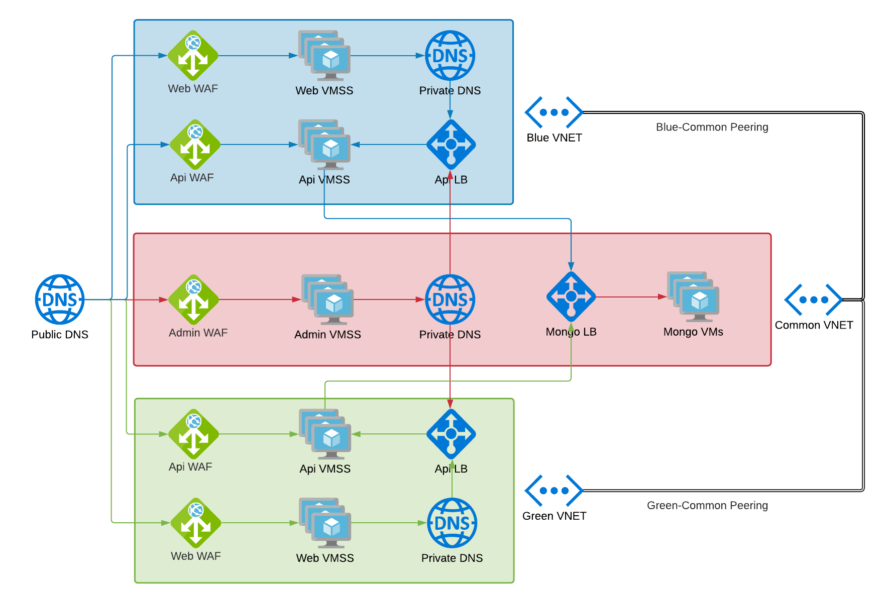

# Masimo SafetyNet (MSN) - Azure

This repo contains **alpha** releases for blue/green and common resources used in the MSN Azure environment.

## Architecture

The following high-level architecture was created for Azure. It is ported from the established AWS architecture, but disparities between the cloud provider services made it necessary to break the architecture into pieces.

As opposed to a single virtual network, each portion (i.e., blue, green, and common resources) of an MSN environment is placed into a separate virtual network. The main benefit here is that updates to the inactive region in a blue-green deployment can be modified without disrupting the active portion. Additionally, blue and green resources are completely segregated from a communication perspective, so there is no fear of crosstalk.

The active region is determined by DNS records placed in the Global Public DNS Zone and the Private DNS Zone inside of the common (red) resource group.

### Blue/Green Resources

* Application gateways are used at the point of ingress for all external traffic. These apply firewall rules and TLS termination.
* Virtual machine scale set backends are used to serve the MSN web app and APIs.
* Private DNS zones are used to define internal traffic flows within a blue or green resource group.
* All outbound traffic is routed to peered PAN devices by way of a user-defined route (UDR).

### Common Resources

* External traffic is not yet entering these resources directly.
* A load balancer is placed in front of three MongoDB virtual machines. These VMs are deployed into an availability set.
* A private DNS zone is used to route internal traffic to the correct blue or green resource group depending on which is active.
* All outbound traffic is routed to peered PAN devices by way of a user-defined route (UDR).

### Global Resources

* A key vault for storing confidential information (e.g., mongo passwords or app gateway certificates).
* A storage account for common data (e.g., mongodumps).
* A user-assigned managed identity to provide VMs direct access to Azure resources (e.g., a mongo VM can access the key vault or storage account without storing secrets on the host).

### Virtual Network Peerings

* Blue/Green VNets are peered to the common VNet in that region.
* All blue, green, and common VNets are peered to the corresponding PAN VNet in that region.

## Procedures

### Mongo backups

In the production (non-DR) deployed region, a cron job (`backup.sh`) is configured on one of the mongo replica VMs which performs the following:

* Logs in to the current Azure environment using the managed identity assigned to that machine
* Retrieves the MongoDB password from the key vault
* Performs a `mongodump` and compresses the resulting archive
* Uploads the file to the Azure storage blob container

### Mongo restore

In a DR scenario, data needs to be restored from a chosen blob to the DR mongo VM. The steps applied should include the following:

* Verify `az cli` is installed on the leader mongo VM
* Verify the managed identity is applied to the leader mongo VM
* Verify the DR VNet and mongo subnet have access to the storage account inside `stmsncommonglobal` "Firewalls and virtual networks"
* Download the storage blob to the VM using `az storage blob download` using `--auth-mode login`
* Extract the blob contents using `tar`
* Perform a `mongorestore` with the resulting files

### Route Outbound Traffic through a NAT Gateway

In the event of a PAN failure, NAT Gateways can be used to force outbound traffic from VMs through pre-configured public IPs. The steps to follow are given below:

* Create a public IP and NAT Gateway
* Remove any user-defined routes that are currently applied to those subnets
* Associate the VM subnet(s) with the NAT Gateway

As an example, `vmss-msn-api-blue-prod` is inside the `apiVmSubnet` which is linked to `udr-msn-pan-blue-prod`.

* Deploy a new NAT Gateway provisioned with a new Public IP
* Disassociate `udr-msn-pan-blue-prod` from `apiVmSubnet`
* Associate the `apiVmSubnet` with the new NAT Gateway
* Traffic leaving `vmss-msn-api-blue-prod` now goes through the NAT Gateway
